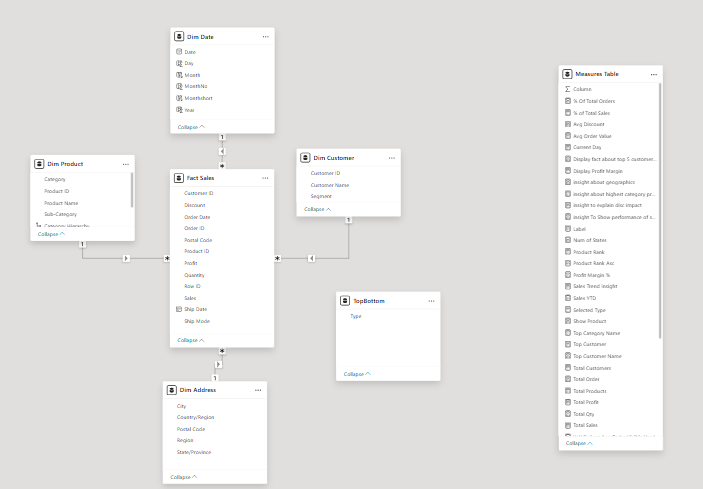

# Retail Sales BI Dashboard

## 📊 Project Overview

This project analyzes retail sales performance using Power BI to identify key drivers of profitability, customer behavior, and the impact of discount strategies.

---

## 🧱 Data Preparation

* Cleaned and transformed raw Excel dataset using Power Query
* Ensured data consistency and handled missing values
* Created a dedicated Date table for time intelligence analysis

---

## 🧩 Data Modeling

* Designed a Star Schema:

  * Fact Table: Sales
  * Dimension Tables: Date, Product, Customer, Location
* Created a separate Measures table
* Established relationships between tables

---

## 📐 DAX Measures

Key measures developed:

* Total Sales
* Total Profit
* Profit Margin
* Total Orders
* Year-over-Year (YoY) Growth

---

## 📈 Dashboard Structure

### 1. Overview

* KPIs with YoY comparison
* Sales trend over time
* Sales & Profit by Category
* Category contribution analysis
* Top 5 Sub-Category Profit
* Sales Contribution by Category

### 2. Product Analysis

* Top & Bottom products by profit
* Category → Sub-category drill-down
* Scatter plot (Sales vs Profit)
* Discount impact on profit margin

### 3. Customer Analysis

* Sales by Region - Map
* Sales by State
* Customer segmentation
* Top customers
* Customer Order Distribution

---

### Model View

## 🔍 Key Insights

📊 Sales grew by ~15% YoY, showing steady overall performance

💰 Technology generates ~50% of total profit while contributing only ~36% of sales

⚠️ Higher discounts are strongly associated with lower profit margins

🌍 100% of revenue comes from North America — strong presence, but also a concentration risk

---

## 🛠 Tools Used

* Power BI
* DAX
* Power Query
* Data Modeling

---

## 📌 Conclusion

The analysis highlights how pricing strategy, product mix, and geographic concentration impact business performance, providing insights for improving profitability and expansion decisions.
